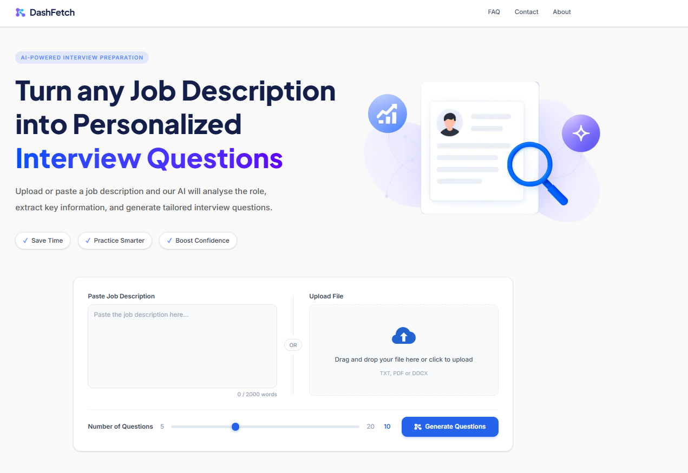
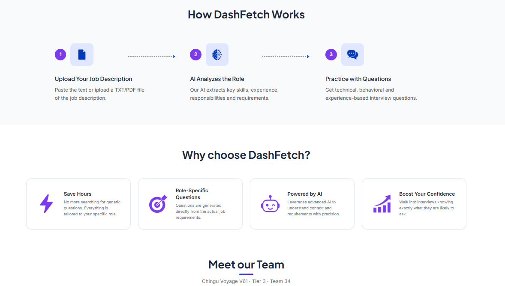
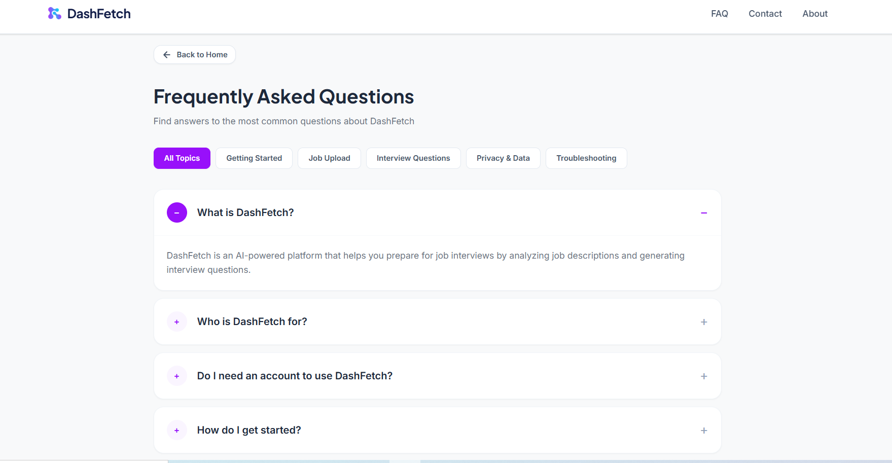

# 🎯 DashFetch — AI-Powered Interview Prep

> Turn any job description into tailored, role-specific interview questions — upload a file or paste the text, and get a structured breakdown plus a Technical / Behavioral / Experience question set to practice with.

[](https://nextjs.org)
[](https://tailwindcss.com)
[](https://supabase.com)
[](https://groq.com)
[](https://vercel.com)
[](https://github.com/ThanasisSoftwareDeveloper/V61-tier3-team-34/actions)

---

> **Live app: [v61-tier3-team-34.vercel.app](https://v61-tier3-team-34.vercel.app)**
> Upload a `.txt`, `.pdf`, or `.docx` job description (or paste it) and go straight from job posting to practice questions.

---

## 📌 Project Overview

### The Challenge

Empower job seekers with fast, personalized, and effective interview preparation by transforming any job description into tailored, role-specific practice questions.

### The Vision

Candidates waste time hunting for practice questions that don't even match the role they're applying for — when the job description itself already contains everything needed to prepare properly. DashFetch reads the responsibilities, required skills, and experience level from a JD and turns them into behavioral, technical, and experience-based questions that mirror what real interviewers ask.

---

## ✨ Key Features

- 📂 **Upload or paste** a job description — `.txt`, `.pdf`, `.docx` supported (`.doc` intentionally excluded)
- 🧠 **AI-powered extraction** of structured job data (title, skills, responsibilities, seniority, etc.) via Groq
- ❓ **Generated interview questions** across three categories — Technical, Behavioral, Experience-based
- 📋 **Job Summary screen** to review the extracted data before practicing
- 🎤 **Mock Interview mode** — one question at a time, with a "Show Answer" reveal and STAR-method tips
- 📱 Fully responsive, accessible UI

---

## 📸 Screenshots

**Home — upload or paste a job description**


**How it works, why choose DashFetch, and the team**


**FAQ**


> Screenshots live in `docs/screenshots/` at the repo root. To add more (e.g. Job Summary, Interview Questions, Mock Interview), drop the PNG/JPG in that folder and reference it the same way: ``.

---

## 🏗️ Architecture

```
V61-tier3-team-34/
├── app/
│   ├── page.js                        # Home — upload/paste a job description
│   ├── job-summary/page.js            # Extracted job data review
│   ├── interview-questions/page.js    # Questions by category (tabs)
│   ├── mock-interview/page.js         # One-question-at-a-time practice
│   └── api/
│       ├── ingest/route.js            # File text extraction only — no Groq calls
│       ├── parse/route.js             # Groq: raw JD text -> 17-field structured JSON
│       └── generate-questions/route.js # Groq: structured JSON -> question set
├── components/                        # Sidebar, Footer, cards, upload zone
├── lib/
│   ├── jobExtraction.js               # Groq prompt + schema for JD parsing
│   └── questionGeneration.js          # Groq prompt for question generation
├── supabase/schema.sql                # Database schema (run once per project)
├── test/                              # Vitest unit tests (23 passing)
└── .github/workflows/                 # CI — Vitest on every PR
```

> `/api/ingest` is a pure parsing/extraction route — it never talks to Groq. Structured extraction and question generation are separate steps (`/api/parse` and `/api/generate-questions`), each with its own prompt and schema.

---

## 🛠️ Tech Stack

| Layer | Technology |
| --- | --- |
| **Framework** | Next.js 15/16 (App Router) — full-stack: React frontend + API routes backend |
| **Styling** | Tailwind CSS, Plus Jakarta Sans & Inter |
| **Database** | Supabase (PostgreSQL) |
| **AI Layer** | Groq — `llama-3.1-8b-instant` |
| **File parsing** | `pdf-parse` (PDF), `mammoth` (DOCX) |
| **Testing** | Vitest (unit), Playwright (planned E2E) |
| **Hosting** | Vercel |
| **CI/CD** | GitHub Actions — runs Vitest on every Pull Request |

> Next.js is full-stack on its own, so frontend and backend deploy together as a single Vercel project.

---

## 🚀 Getting Started

### Prerequisites

- Node.js 18+
- A Supabase project
- A Groq API key

### 1. Clone the repo

```bash
git clone https://github.com/ThanasisSoftwareDeveloper/V61-tier3-team-34.git
cd V61-tier3-team-34
```

### 2. Install & configure

```bash
npm install
cp .env.example .env.local   # fill in Supabase + Groq credentials
```

```
SUPABASE_URL=
SUPABASE_SERVICE_ROLE_KEY=
GROQ_API_KEY=
```

> `SUPABASE_SERVICE_ROLE_KEY` is server-only and must never be exposed in client-side code or `NEXT_PUBLIC_` variables.

Run `supabase/schema.sql` in the Supabase SQL editor for your project to set up the database.

### 3. Run locally

```bash
npm run dev
```

App runs at `http://localhost:3000`.

### Scripts

| Command | Description |
| --- | --- |
| `npm run dev` | Start the local dev server |
| `npm run build` | Production build |
| `npm run lint` | Run ESLint |
| `npm test` | Run the Vitest suite once |
| `npm run test:watch` | Run Vitest in watch mode |

---

## 📖 Usage

1. Open the [live app](https://v61-tier3-team-34.vercel.app) (or `http://localhost:3000` locally)
2. Upload a job description file, or paste the text directly
3. Review the extracted job data on the **Job Summary** screen
4. Browse generated **Technical / Behavioral / Experience** questions
5. Switch to **Mock Interview** mode to practice one question at a time

> ⏳ On first use after a period of inactivity, file-upload parsing may have a short cold-start delay — this is expected Vercel free-tier behavior.

---

## ⚙️ Groq Free-Tier Constraints

The Groq free tier's tokens-per-minute limit is a hard constraint the app is built around, not an edge case:

- Input text is truncated at **24,000 characters** before being sent to Groq
- The model was switched from `llama-3.3-70b-versatile` to **`llama-3.1-8b-instant`** specifically to stay within TPM limits

---

## 🛡️ Reliability & Resiliency

To handle Groq's free-tier limits and potential network hiccups, the backend implements a customized **Exponential Backoff with Jitter** retry framework and isolated database persistence callbacks.

👉 **[Read the full AI Services Documentation](./docs/ai-services.md)** for deep-dives into rate-limiting, retry formulas, and database resilience.

---

## 🧪 Testing & CI

| Check | Tool | Status |
| --- | --- | --- |
| Unit tests | Vitest | ✅ 23 tests passing |
| CI pipeline | GitHub Actions | ✅ runs on every Pull Request |
| E2E tests | Playwright | 🔜 planned |

---

## 🗺️ Roadmap

- [ ] Rate limit handling & input validation hardening
- [ ] Session retrieval API
- [ ] Environment variables documentation
- [ ] Loading skeletons for Job Summary & Interview Questions pages
- [ ] Error state UI
- [ ] Mobile navigation fix
- [ ] Server-side word count enforcement for PDF/DOCX uploads
- [ ] GitHub Actions pipeline documentation
- [ ] Playwright E2E test suite
- [ ] Vercel deployment guide

---

## 👥 Meet the Team — Chingu Voyage V61, Tier 3, Team 34

| Name | Role |
| --- | --- |
| **Roger** | Scrum Master |
| **Thanasis** | Web Developer |
| **Jason** | Web Developer |
| **Vanessa** | Web Developer |
| **Simbongile** | Web Developer |
| **Val** | Technical Guide |

Project tracked on Jira: `bannerbright.atlassian.net` (project **CT**).

---

## 📄 License

Built as part of [Chingu](https://www.chingu.io) Voyage V61.

---

Built by the DashFetch team · [Live App](https://v61-tier3-team-34.vercel.app) · [Repo](https://github.com/ThanasisSoftwareDeveloper/V61-tier3-team-34)
